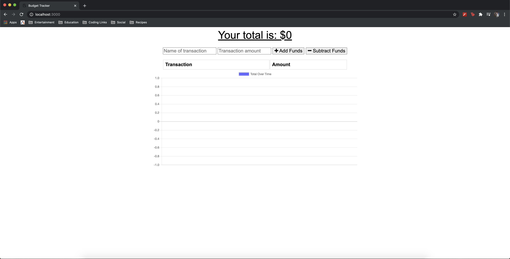
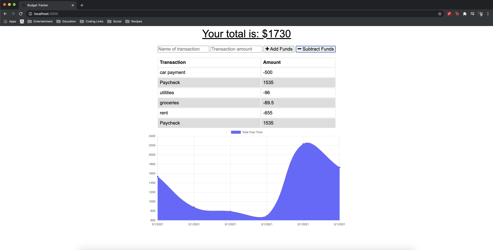

# Budget

## Table of Contents
* [Installation](#installation)
* [Description](#discription)
* [Contribution](#contribution)
* [Contact](#contact)

## Installation

No installation required. Users will be directed to the heroku link listed below or on the repo page which brings you to a live website that will take information from the user to track their budget needs with and without an internet connection.

## Description

The budget tracker app allows users to track their expenses with or without internet connection. When the users is able to get a connection again, the locally stored data will be automatically sent to our Mongo Atlas database. This way, regardless of acceess to wireless the user's expenses will be tracked to ensure they do not go over or under budget.

The app works by checking if the user is online first. If so, the information passes straight from the app to our mongodb. If we are offline, the information is passed to the indexedDB built into web browsers. When the user reestablishes a connection, the user's data that was held while offline is batch pushed to the mongo atlas db.

## Contribution

If you think you can add functionality to this project, see a bug, or have styling suggestions, please feel free to message me through one of my contact options listed below.

# Contact

* Email: evanfurniss@gmail.com
* LinkedIn: https://www.linkedin.com/in/evan-furniss/
* GitHub: https://github.com/evanfurniss

## Demo

Live app: https://pacific-reaches-97106.herokuapp.com/

Live repo: https://github.com/evanfurniss/budget-tracker

